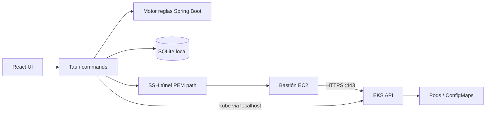

# 2. Arquitectura del sistema

> Sincronizado con Spec Kit plan + auth IAM file path (2026-07-23).  
> Wireframes: `specs/001-eks-log-monitor/wireframes/`. Diagramas: `docs/architecture/` (contexto en 3 columnas).

## 2.1. Diagrama de arquitectura

**Fuente formal (draw.io):** [`docs/architecture/`](docs/architecture/)

| Diagrama | SVG (lectura rápida) | Editable |
|----------|----------------------|----------|
| Contexto del sistema | [01-system-context.svg](docs/architecture/01-system-context.svg) | [.drawio](docs/architecture/01-system-context.drawio) |
| Componentes internos | [02-components.svg](docs/architecture/02-components.svg) | [.drawio](docs/architecture/02-components.drawio) |
| Secuencia conexión/logs | [03-connection-sequence.svg](docs/architecture/03-connection-sequence.svg) | [.drawio](docs/architecture/03-connection-sequence.drawio) |

Resumen Mermaid (equivalente al contexto):



**Patrón:** app de escritorio (Tauri 2) con UI en webview (React/TS) y backend nativo (Rust). Persistencia local SQLite. Una sesión de cluster **activa** a la vez; varios ambientes pueden estar cargados en UI.

## 2.2. Componentes principales

| Componente | Tecnología | Rol |
|------------|------------|-----|
| UI | React + TS + Vite | Chrome Ambiente/Ver, catálogo Deployments/Pods/ConfigMaps, pestañas de vistas, Structured/Raw, panel de hallazgo |
| Shell | Tauri 2 | Ventana, IPC, empaquetado Win/macOS/Linux |
| Commands | Rust | Ambientes, túnel, AWS token, kube solo lectura, logs, análisis local |
| SSH | russh (o `ssh` sistema controlado) | Port-forward al bastión; PEM solo por **ruta** |
| AWS | aws-sdk-rust | Lee archivo IAM (ruta) → token EKS; `region_name` + `cluster_name` |
| K8s | kube-rs | List Deployments/pods/ConfigMaps; get logs (follow) |
| BD | SQLite (`tauri-plugin-sql`) | Ambientes, prefs (tema), historial ligero de hallazgos |
| Reglas | Motor local (patrones) | Spring Boot al click; **sin** IA generativa en producto |

## 2.3. Estructura de ficheros (objetivo post-scaffold)

```text
faro/
├── specs/001-eks-log-monitor/   # plan, data-model, contracts, wireframes
├── src/                         # React + Vite
├── src-tauri/                   # Rust / Tauri commands
├── docs/architecture/           # draw.io + SVG (contexto, componentes, secuencia)
└── 0–7 + readme / prompts       # entrega AI4Devs
```

Detalle de árbol Spec Kit: [`plan.md`](specs/001-eks-log-monitor/plan.md).

## 2.4. Infraestructura y despliegue

- Entrega: instalador/binario de escritorio + demo en vivo o grabación.
- URL pública: **no estricta**.
- CI deseable: build + tests (Vitest, `cargo test`, ≥1 E2E).

## 2.5. Seguridad

- PEM e IAM: solo **rutas** locales (no embeber / no subir secretos a SQLite).
- Identificadores: `region_name`, `cluster_name`, bastión SSH (host/puerto/user).
- Formulario nuevo ambiente: PEM + SSH + ruta IAM + región + cluster.
- TLS con CA del cluster; sin `insecure-skip-tls` en uso real.
- RBAC v1: solo lectura (`get/list/watch` pods, `get` pods/log, ConfigMaps read).
- **No exfiltración (constitution VI):** prohibido enviar credenciales o datos de dominio del usuario a terceros/telemetría/LLM; la única salida no configurada por el usuario puede ser metadata de la herramienta (p. ej. versión). Tráfico a bastión/EKS configurado por el usuario = uso legítimo.

## 2.6. Tests

| Capa | Herramienta | Alcance |
|------|-------------|---------|
| Unit | Vitest / `cargo test` | UI helpers, reglas, parsing |
| Integración | Commands + SQLite | CRUD ambientes, connect mockeable |
| E2E | Playwright o Tauri WebDriver | ≥1 flujo: ambiente → conectar → logs → hallazgo |

Detalle en `TESTING.md` (pendiente). Quickstart técnico: [`specs/001-eks-log-monitor/quickstart.md`](specs/001-eks-log-monitor/quickstart.md).

## 2.7. IA / menús (contrato UI)

Ver [`contracts/ui-ia.md`](specs/001-eks-log-monitor/contracts/ui-ia.md) y wireframes actuales:

| Menú | Opciones |
|------|----------|
| **Ambiente** | Configurar nuevo · Cargar · Cargar varios · Desconectar |
| **Ver** | Modo claro · Modo oscuro |

Selector de ambiente activo en chrome (arriba-derecha). Hasta **4** pestañas de vista abiertas (Pods Structured / ConfigMaps Raw según tipo).
