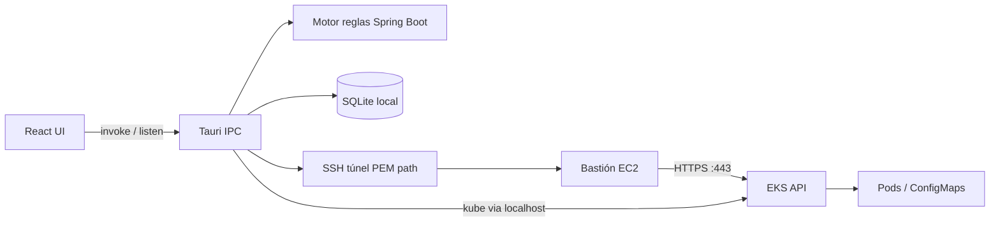

# 2. Arquitectura del sistema

> Sincronizado con Spec Kit plan + **tasks** (base 2026-07-23; UI sync 2026-07-27): splash branded + geometría ventana (`007`) + SQLite durable/session + **IPC** + **US1–US10** → tickets HU1–HU15.  
> Wireframes: `specs/001-eks-log-monitor/wireframes/`. Diagramas: `docs/architecture/`.  
> Contrato IPC: [`4-comandos-y-eventos-ipc.md`](4-comandos-y-eventos-ipc.md).  
> Ejecución: [`tasks.md`](specs/001-eks-log-monitor/tasks.md) · [`6-tickets-de-trabajo.md`](6-tickets-de-trabajo.md).

## 2.1. Diagrama de arquitectura

**Fuente formal (draw.io):** [`docs/architecture/`](docs/architecture/)

| Diagrama | SVG (lectura rápida) | Editable |
|----------|----------------------|----------|
| Contexto del sistema | [01-system-context.svg](docs/architecture/01-system-context.svg) | [.drawio](docs/architecture/01-system-context.drawio) |
| Componentes internos | [02-components.svg](docs/architecture/02-components.svg) | [.drawio](docs/architecture/02-components.drawio) |
| Secuencia conexión/logs | [03-connection-sequence.svg](docs/architecture/03-connection-sequence.svg) | [.drawio](docs/architecture/03-connection-sequence.drawio) |
| ER SQLite (durable + session) | [04-sqlite-er.svg](docs/architecture/04-sqlite-er.svg) | [.drawio](docs/architecture/04-sqlite-er.drawio) |
| IPC commands vs events | [05-ipc-commands-events.svg](docs/architecture/05-ipc-commands-events.svg) | [.drawio](docs/architecture/05-ipc-commands-events.drawio) |

Resumen Mermaid (equivalente al contexto):



**Arranque:** splash branded (**576×324**, fija, centrada) → `session_purge_ephemeral` (+ dwell ≥5s) → principal (**900×600**, centrada, redimensionable).

**Patrón:** app de escritorio (Tauri 2) con UI en webview (React/TS) y backend nativo (Rust). Comunicación UI↔Rust = **commands + events** (sin HTTP). Persistencia SQLite en dos capas (durable + session cache). Una sesión de cluster **activa** a la vez.

## 2.2. Componentes principales

| Componente | Tecnología | Rol |
|------------|------------|-----|
| UI | React + TS + Vite | Splash, chrome Ambiente/Ver, catálogo Deployments/Pods/ConfigMaps, pestañas, Structured/Raw, panel de hallazgo |
| Shell | Tauri 2 | Ventana (mínima + principal), IPC, empaquetado Win/macOS/Linux |
| Commands / Events | Rust + Tauri IPC | `invoke` (CRUD, connect, analyze) + `emit` (`logs_chunk`, `logs_status`) |
| SSH | russh (o `ssh` sistema controlado) | Port-forward al bastión; PEM solo por **ruta** |
| AWS | aws-sdk-rust | Lee archivo IAM (ruta) → token EKS; `region_name` + `cluster_name` |
| K8s | kube-rs | List Deployments/pods/ConfigMaps; get logs (follow); hydrate 1× por connect |
| BD | SQLite (`tauri-plugin-sql`) | Durable: ambientes, prefs, historial ligero. Session: catálogo (purge en splash/disconnect) |
| Reglas | Motor local (patrones) | Spring Boot al click; **sin** IA generativa en producto |

## 2.3. Estructura de ficheros (objetivo post-scaffold)

```text
faro/
├── specs/001-eks-log-monitor/   # plan, data-model, contracts/ipc-*, wireframes (01-06)
├── src/                         # React + Vite
├── src-tauri/                   # Rust / Tauri commands + events
├── docs/architecture/           # draw.io + SVG (01-05)
├── 4-comandos-y-eventos-ipc.md  # entrega: mapa IPC
└── 0–7 + readme / prompts       # entrega AI4Devs
```

Detalle: [`plan.md`](specs/001-eks-log-monitor/plan.md).

## 2.4. Infraestructura y despliegue

- Entrega: instalador/binario de escritorio + demo en vivo o grabación.
- URL pública: **no estricta**.
- CI deseable: build + tests (Vitest, `cargo test`, ≥1 E2E).

## 2.5. Seguridad

- PEM e IAM: solo **rutas** locales (no embeber / no subir secretos a SQLite).
- Identificadores: `region_name`, `cluster_name`, bastión SSH (host/puerto/user).
- Formulario nuevo ambiente: PEM + SSH + ruta IAM + región + cluster.
- TLS con CA del cluster; sin `insecure-skip-tls` en uso real.
- RBAC v1: solo lectura (`get/list/watch` pods, `get` pods/log, ConfigMaps read).
- **No exfiltración (constitution VI):** prohibido enviar credenciales o datos de dominio del usuario a terceros/telemetría/LLM; la única salida no configurada por el usuario puede ser metadata de la herramienta (p. ej. versión). Tráfico a bastión/EKS configurado por el usuario = uso legítimo.
- Splash purge: solo tablas `«session»` / logs efímeros; **nunca** perfiles de ambiente durables.

## 2.6. Tests

| Capa | Herramienta | Alcance |
|------|-------------|---------|
| Unit | Vitest / `cargo test` | UI helpers, reglas, parsing, purge |
| Integración | Commands + SQLite | CRUD ambientes, connect mockeable, splash purge |
| E2E | Playwright o Tauri WebDriver | ≥1 flujo: splash → ambiente → conectar → logs → hallazgo |

Detalle en `TESTING.md` (pendiente). Quickstart: [`specs/001-eks-log-monitor/quickstart.md`](specs/001-eks-log-monitor/quickstart.md).

## 2.7. IA / menús (contrato UI)

Ver [`contracts/ui-ia.md`](specs/001-eks-log-monitor/contracts/ui-ia.md) y wireframes:

| Menú | Opciones |
|------|----------|
| **Ambiente** | Configurar nuevo · Cargar · Cargar varios · Desconectar |
| **Ver** | Modo claro · Modo oscuro |

Selector de ambiente activo en chrome (arriba-derecha). Hasta **4** pestañas de vista abiertas (Pods Structured / ConfigMaps Raw según tipo).

## 2.8. Comandos y eventos IPC

Contrato UI ↔ Rust (sin HTTP): [`4-comandos-y-eventos-ipc.md`](4-comandos-y-eventos-ipc.md) · diagrama [`05-ipc-commands-events`](docs/architecture/05-ipc-commands-events.drawio).
