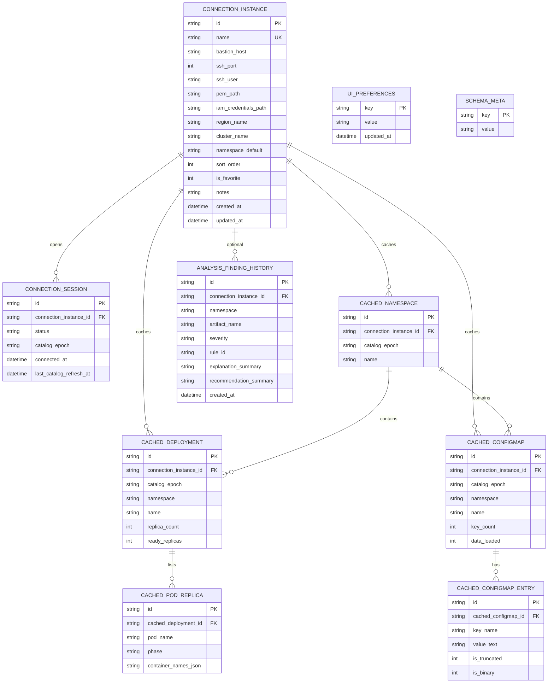

# 3. Modelo de datos

> Sincronizado con [`specs/001-eks-log-monitor/data-model.md`](specs/001-eks-log-monitor/data-model.md) (SQLite durable + session + splash purge; HU1/HU2).  
> Diagrama editable: [`docs/architecture/04-sqlite-er.drawio`](docs/architecture/04-sqlite-er.drawio).  
> IPC que lee/escribe estas tablas: [`4-comandos-y-eventos-ipc.md`](4-comandos-y-eventos-ipc.md).

## 3.1. Capas de persistencia

| Capa | ¿Sobrevive reinicio? | Contenido |
|------|----------------------|-----------|
| **Durable** | Sí | Ambientes, preferencias UI, historial ligero de hallazgos |
| **Session cache** | **No** — purge en splash / disconnect / cierre | Catálogo AWS/K8s (1× por conexión) + sesión |
| **Runtime** | N/A (RAM) | Buffers de logs, ventanas, write-groups |

**Ciclo del cache de sesión:** **splash** → `session_purge_ephemeral` (borra solo `«session»`/logs efímeros; **conserva** ambientes y prefs) → main UI → `env_connect` OK → hydrate una vez → UI lee SQLite → `disconnect` / cierre (best-effort) → DELETE sesión → siguiente launch regenera vía splash.

## 3.2. Diagrama ER (SQLite)



## 3.3. Entidades durables

### ConnectionInstance (Ambiente)

Perfil de acceso: bastión SSH, **ruta** PEM, **ruta** IAM, `region_name`, `cluster_name`, namespace opcional, `sort_order`, `is_favorite`, `notes`.  
**No** almacena bytes del `.pem` ni Access Key/Secret.

### UiPreferences

Clave/valor: `theme`, `last_active_instance_id`, opcional layout (`sidebar_width_px`, `default_component_type`).

### AnalysisFindingHistory (ligero)

Resúmenes de hallazgos (severidad / `rule_id` / textos cortos). **Sin** cuerpos de stacktrace ni dumps de logs.

### SchemaMeta

Versión de esquema / migraciones.

## 3.4. Entidades de session cache (efímeras)

| Tabla | Rol |
|-------|-----|
| **connection_session** | Estado de la conexión activa + `catalog_epoch` |
| **cached_namespace** | Namespaces listados en el hydrate |
| **cached_deployment** | Workloads para el catálogo Pods |
| **cached_pod_replica** | Réplicas / contenedores (atribución, multi-container) |
| **cached_configmap** | Lista de ConfigMaps (`data_loaded` 0/1) |
| **cached_configmap_entry** | Keys/values (truncados) cargados al abrir |

## 3.5. Runtime (no tablas)

`SessionState`, `LogWindow`, `LogWriteGroup`, `AnalysisFinding` — buffers y UI en memoria.

## 3.6. Transiciones

```text
disconnected → connecting → connected + catalog_hydrate(epoch)
                 ↓
               error → disconnected (cache del ambiente limpio)

catalog_refresh → nuevo epoch
disconnect / app_exit (best-effort) → purge tablas «session»
splash → session_purge_ephemeral (KEEP connection_instance + prefs)

open logs → structured (default) ↔ raw
structured + click error → finding | vacío → opcional history summary
```
