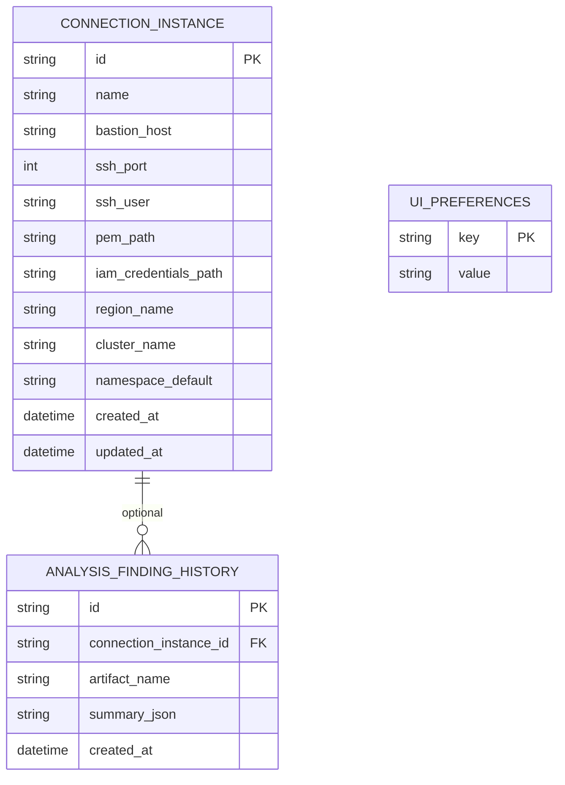

# 3. Modelo de datos

> Sincronizado con [`specs/001-eks-log-monitor/data-model.md`](specs/001-eks-log-monitor/data-model.md) (post `/speckit-plan` — auth IAM file path).

## 3.1. Diagrama



Entidades de **sesión/UI** (no necesariamente tablas): `SessionState`, `DeploymentArtifact`, `ConfigMapArtifact`, `LogWindow`, `LogWriteGroup`, `AnalysisFinding`.

## 3.2. Entidades persistentes

### ConnectionInstance (Ambiente)

Perfil de acceso: bastión SSH (host, puerto, user), **ruta** PEM, **ruta** al archivo IAM (`aws_access_key_id` / `aws_secret_access_key`), `region_name`, `cluster_name`, namespace opcional.  
**No** almacena bytes del `.pem` ni Access Key/Secret. Se leen del filesystem al conectar.  
Validación: host, puerto, user, pem_path, iam_credentials_path, region_name, cluster_name obligatorios.

### UiPreferences

Clave/valor local. Incluye `theme` (`light` \| `dark`) y `last_active_instance_id`.

### AnalysisFindingHistory (opcional, ligero)

Metadatos de hallazgos (severidad/resumen) ligados a un ambiente. **No** dumps completos de logs (constitution + export OoS).

## 3.3. Entidades de runtime / UI

| Entidad | Rol |
|---------|-----|
| **SessionState** | Ambiente activo, status de conexión, ambientes cargados, tipo de componente (`pods` \| `configmaps`), filtro namespace |
| **DeploymentArtifact** | Workload + réplicas; abre como máximo una ventanilla de logs por artefacto |
| **ConfigMapArtifact** | Nombre + keys; vista solo lectura **Raw** |
| **LogWindow** | Modo `structured` (default) \| `raw`; follow; búsqueda; buffer en memoria (anillo) |
| **LogWriteGroup** | Unidad Structured: una **escritura** al stream → un grupo; clickable si `is_likely_error` |
| **AnalysisFinding** | Severidad, explicación simple, recomendación, `rule_id` local |

## 3.4. Transiciones relevantes

```text
disconnected → connecting → connected
                 ↓
               error → disconnected (reintento / cambio de ambiente)

open logs → structured (default)
structured ↔ raw   (misma sesión follow)

structured + click error → running_rules → finding | vacío
```

Sin transición “Analizar todo el buffer” en MVP.
