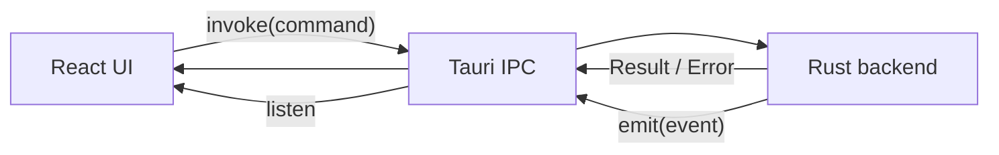
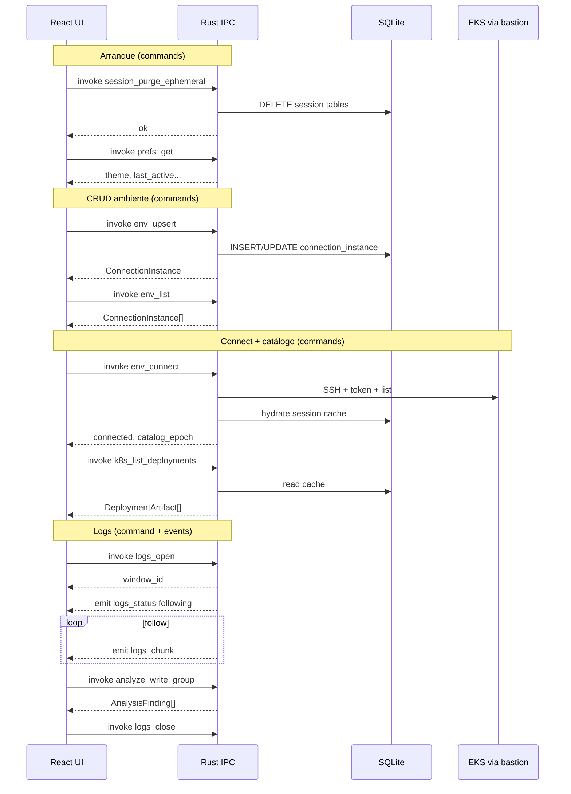

# 4. Comandos y eventos IPC

> Faro **no** expone API HTTP REST. El contrato frontend ↔ backend es **Tauri IPC**:  
> **Commands** (`invoke`, request/response) y **Events** (`emit`/`listen`, push).  
> Fuente Spec Kit: [`contracts/ipc-commands-events.md`](specs/001-eks-log-monitor/contracts/ipc-commands-events.md).  
> Diagrama: [`docs/architecture/05-ipc-commands-events.drawio`](docs/architecture/05-ipc-commands-events.drawio).  
> Trazabilidad HU: [`5-historias-de-usuario.md`](5-historias-de-usuario.md) (US1–US10) · Tasks: [`tasks.md`](specs/001-eks-log-monitor/tasks.md).

## 4.0. Cómo se comunican



| Tipo | Quién inicia | Patrón | Ejemplos |
|------|--------------|--------|----------|
| **Command** | UI | 1 petición → 1 respuesta | `env_list`, `env_upsert`, `env_connect`, `analyze_write_group` |
| **Event** | Backend | 0..N avisos en el tiempo | `logs_chunk`, `logs_status` |

**Reglas transversales**

- Solo conexiones a bastión/EKS configurados por el usuario.
- Sin mutaciones Kubernetes en v1.
- Errores accionables **sin** secretos en mensajes.
- `analyze_write_group` **no** envía payload fuera de la máquina.
- CRUD de ambientes = commands sobre SQLite durable (no HTTP).

---

## 4.1. Mapa de commands

### Startup / prefs

| Command | In | Out |
|---------|----|-----|
| `session_purge_ephemeral` | — | purge ok (solo `«session»`) |
| `prefs_get` | — | prefs (`theme`, `last_active_instance_id`, …) |
| `prefs_set` | key/value | — |

### Ambientes (CRUD + sesión)

| Command | Rol CRUD / acción | In | Out |
|---------|-------------------|----|-----|
| `env_list` | Read | — | `ConnectionInstance[]` |
| `env_upsert` | Create/Update | campos modelo (paths only) | instancia |
| `env_delete` | Delete | `id` | — |
| `env_load` | Acción UI | `ids[]` | — |
| `env_set_active` | Acción | `id` | — |
| `env_connect` | Acción | ambiente activo | status + `catalog_epoch` |
| `env_disconnect` | Acción | — | — |

`env_upsert`: rechaza paths vacíos; nunca PEM/IAM secret en el payload.  
`env_connect`: IAM file → token; hydrate catálogo 1×. `env_disconnect` / splash: limpia session cache.

### Catálogo (read-only; preferir cache)

| Command | In | Out |
|---------|----|-----|
| `k8s_list_deployments` | `namespace?` | `DeploymentArtifact[]` |
| `k8s_list_configmaps` | `namespace?` | `ConfigMapArtifact[]` |
| `k8s_get_configmap` | `namespace`, `name` | keys/values (truncado) |
| `catalog_refresh` | — | nuevo `catalog_epoch` |

### Logs y análisis

| Command | In | Out | Side-effect |
|---------|----|-----|-------------|
| `logs_open` | namespace, deployment | `window_id` | Empieza follow → **events** |
| `logs_close` | `window_id` | — | Para stream |
| `logs_set_view` | window, `structured`\|`raw` | — | Solo UI |
| `analyze_write_group` | texto write-group | `AnalysisFinding[]` | Local |

---

## 4.2. Mapa de events

| Event | Cuándo | Payload |
|-------|--------|---------|
| `logs_chunk` | Tras `logs_open`, mientras hay follow | escritura + pod + timestamp? |
| `logs_status` | Apertura / idle / error / sin pods | enum status |

Frontend: Structured agrupa por frontera de escritura; Raw sin manipulación. Buffers en **RAM**.

---

## 4.3. Visualización de comunicaciones IPC



Diagrama editable (draw.io): [`05-ipc-commands-events.drawio`](docs/architecture/05-ipc-commands-events.drawio) · SVG: [`05-ipc-commands-events.svg`](docs/architecture/05-ipc-commands-events.svg).

---

## 4.4. Ejemplo de shape — command `env_connect`

No es HTTP; solo documenta el contrato del `invoke`:

```yaml
command: env_connect
transport: tauri-ipc
request:
  instance_id: uuid  # opcional si ya hay activo
response_ok:
  status: connected
  cluster_name: string
  catalog_epoch: string
response_err:
  message: string  # sin secretos
```

Schemas tipados TS/Rust se fijan al implementar.
