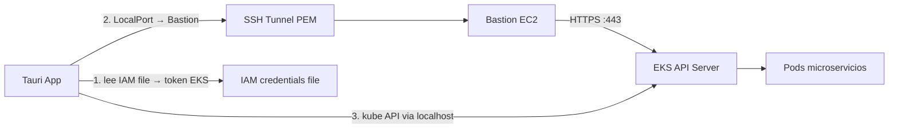

# Faro — visor de logs EKS vía bastión

**Nombre del producto:** Faro  
**Tagline:** *Ilumina los logs. Gobierna el cluster.*  
**Repo / paquete:** `faro` (p. ej. `specify init faro --integration cursor`)  
**Contexto académico:** proyecto final de máster (AI4Devs) — producto E2E con IA en todas las fases y criterio humano de revisión.

## Requisitos del máster (obligatorios)

Marco de entrega oficial. Faro debe cumplir esto además del MVP técnico.

### Propósito
Producto de software **end-to-end** (idea → despliegue), con **IA en todas las fases** y revisión humana para corregir y elevar calidad.

### Alcance MVP (académico)
- Dominio libre (Faro encaja: herramienta cercana al trabajo / ops K8s).
- Un **flujo E2E prioritario** que cree valor completo.
- Marco académico: **3–5 historias Must-Have** y **1–2 Should-Have** opcionales para el flujo E2E.
- **Faro (Spec Kit, 2026-07-23):** el mismo alcance se controla con **10 historias atómicas** (US1–US10): Must P1 = US1–US8, Should P2 = US9 (tema), Must P3 = US10 (desktop). Ver [`5-historias-de-usuario.md`](../5-historias-de-usuario.md).

### Artefactos a producir (progresivos en 3 entregas)
| Artefacto | Cómo lo cubre Faro |
|-----------|-------------------|
| Documentación de producto | `readme.md` + docs `0`–`7` (formato Example1) + Spec Kit |
| Historias + tickets + criterios de aceptación + trazabilidad | `5-` / `6-` / `7-*.md` + Spec Kit tasks/PRs |
| Arquitectura y modelo de datos | `2-` / `3-*.md` + `docs/architecture/` (draw.io) + SQLite |
| Backend con acceso a BD | Rust/Tauri commands + SQLite (`tauri-plugin-sql`) |
| Frontend con flujo E2E usable | React (UI Faro) |
| Suite de tests | Unitarios + integración + **≥1 E2E** del flujo principal (`TESTING.md`) |
| Infra y despliegue | CI básico (build+tests); demo ejecutable (URL pública no estricta) |
| Registro de uso de IA | `prompts.md` (≤3 prompts clave por sección + notas humanas) |

### Formato de entrega (repo AI4Devs — Example1)
Referencia: [AI4Devs-finalproject-Example1](https://github.com/LIDR-academy/AI4Devs-finalproject-Example1).

Usamos **Spec Kit** para SDD (`.specify/`, specs, tasks), pero la **documentación de entrega del máster** sigue el formato del ejemplo:

| Archivo | Rol |
|---------|-----|
| `readme.md` | Índice + resumen de secciones 0–7 + quick start |
| `0-ficha-del-proyecto.md` | Nombre, autor, descripción breve, URLs |
| `1-descripcion-general-del-producto.md` | Objetivo, features, UX, instalación |
| `2-arquitectura-del-sistema.md` | Diagramas, componentes, infra, seguridad, tests |
| `3-modelo-de-datos.md` | ER (Mermaid) + entidades |
| `4-comandos-y-eventos-ipc.md` | **Comandos y eventos** Tauri IPC (mapa invoke/emit); sustituye la sección “API” HTTP de la plantilla |
| `5-historias-de-usuario.md` | 10 HU atómicas (US1–US10) con criterios de aceptación |
| `6-tickets-de-trabajo.md` | 10 tickets (1/HU) + mapeo capas BD/Backend/Frontend; traza a `tasks.md` T001–T085 |
| `7-pull-requests.md` | ≥3 PRs documentadas |
| `prompts.md` | ≤3 prompts clave por sección + notas de guía humana |

**Reglas:**
- El `readme.md` mantiene el **mismo índice (0–7)** que el ejemplo; cada sección resume y enlaza al `.md` detallado.
- Spec Kit genera artefactos técnicos; **no sustituye** estos documentos de entrega — se sincronizan (spec/tasks → historias/tickets; plan/arquitectura → docs 2–4).
- Completar de forma **progresiva** en las 3 entregas (como el ejemplo: algunos docs “Completo”, otros “Pendiente”).
- Complementarios deseables (como el ejemplo): `QUICK-START.md`, `TESTING.md`, carpeta `diagramas/` o `docs/architecture/`, mockups/wireframes.

### Libertad tecnológica
Stack a elección si el resultado es **ejecutable**, **comprensible** y **razonablemente documentado**. Faro: Tauri 2 + React + TS + SQLite + Spec Kit (acorde al plan).

### Decisión: demostración / “URL pública”
El requisito de URL pública **no es estricto**: los evaluadores indicaron que **con verlo funcionar basta**.

**Enfoque Faro:**
- Entregable principal: **app de escritorio** (Tauri) ejecutable / instalable.
- Demostración: grabación corta, sesión en vivo, o instrucciones de arranque local en `readme.md`.
- CI/CD sigue siendo deseable (build + tests en pipeline); **no bloquea** el MVP si no hay hosting web público.
- Opcional más adelante: página estática de producto o releases en GitHub Releases (no obligatorio para aprobar).

### Flujo E2E prioritario (candidato)
> Colega configura instancia → conecta vía bastión → elige Pods o ConfigMaps → abre logs de un Deployment (Structured por defecto / Raw con botón) → click en stacktrace/error → panel Spring Boot (severidad + explicación simple + acción). Export y Analizar de buffer fuera de MVP.

### Historias (formalizadas en Spec Kit)
Ver `specs/001-eks-log-monitor/spec.md` y `5-historias-de-usuario.md`.

**Must-Have:**
1. Instancias de conexión (N ambientes, PEM path, sin secretos en claro).
2. Conectar y explorar **Pods (por Deployment)** + **ConfigMaps**.
3. Ventanilla de logs: follow en vivo; **Structured** (default, por escritura) + **Raw** (botón, sin manipulación).
4. Click en error/stacktrace → motor **Spring Boot** (sin Analizar de buffer).
5. Empaquetado desktop Windows / macOS / Linux.

**Fuera de MVP:** export de logs; Analizar de buffer; otros componentes; otras tecnologías de reglas.

## Proceso: Spec Kit (elegido)

Usaremos [GitHub Spec Kit](https://github.github.com/spec-kit/) para Spec-Driven Development. El código no se escribe “a ojo”: primero constitution → spec → plan → tasks → implement.

**Bootstrap (antes de código de producto):**
```bash
uv tool install specify-cli
specify init faro --integration cursor
# o: specify init . --integration cursor  (si el repo ya existe)
```

**Flujo de comandos (en Cursor):**
1. `/speckit.constitution` — reglas del proyecto (marca Faro, seguridad PEM/AWS, solo lectura K8s en v1, multiplataforma).
2. `/speckit.specify` — qué construir y por qué (sin fijar stack todavía en el artefacto de spec).
3. `/speckit.clarify` — cerrar ambigüedades (si hace falta).
4. **Mockups (extensión wireframe)** — ver sección siguiente.
5. `/speckit.plan` — decisiones técnicas: Tauri 2, React, SQLite, SSH/EKS, analizador por reglas.
6. `/speckit.tasks` — desglose en tareas ordenadas.
7. `/speckit.implement` — implementación guiada por las tasks (honra wireframes firmados).
8. `/speckit.converge` — verificar cobertura vs spec.

Las decisiones de este documento Cursor alimentan `/speckit.plan`; la fuente de verdad del repo serán los artefactos bajo `.specify/` / specs generados por Spec Kit.

## Mockups / UI (elegido para Spec Kit)

Spec Kit **no dibuja Figma por sí solo**; lo que mejor integra es la extensión comunitaria **wireframe**:

```bash
specify extension add wireframe
```

**Por qué esta opción (y no Figma como fuente principal):**
- Genera **SVG en el repo** a partir de `spec.md` (`/speckit.wireframe.generate`).
- Tras `/speckit.wireframe.review` + sign-off, las rutas quedan en `spec.md` bajo `## UI Mockup`.
- `/speckit.plan`, `/tasks` e `/implement` las tratan como **restricción visual obligatoria**.
- Todo versionado en Git; el agente de Cursor puede leer los SVG.

**Pantallas wireframeadas (SVG en `specs/001-eks-log-monitor/wireframes/`; sign-off pendiente):**
1. Splash / preparando (`01`)
2. Workspace vacío + selector Ambiente (`02`)
3. Modal nueva conexión (`03`)
4. Ambiente cargado — Deployments / Pods / Structured (`04`)
5. ConfigMaps — vista Raw (`05`)
6. Hallazgo Structured al click en ERROR (`06`)

**Nota:** `/speckit.plan` + `/speckit.tasks` hechos (`plan.md`, `data-model.md`, `contracts/`, `tasks.md` T001–T085, sync AI4Devs `0`–`6`). Diagramas draw.io `01`–`05` en `docs/architecture/`. Pendiente: wireframe sign-off + `/speckit.implement` + PRs (`7`).

**No usamos Figma como fuente de verdad** en este proyecto (rompe el bucle SDD salvo que exportes y copies a mano). Si más adelante hay diseño de marca, se puede anexar PNG de referencia, pero los wireframes SVG siguen siendo el contrato con Spec Kit.

## Diagramas de arquitectura (draw.io)

Para **arquitectura y componentes** usamos **draw.io** (diagrams.net), versionado en el repo. Complementa los wireframes (UI) sin sustituirlos.

**Convención en el repo:**
```
docs/architecture/
  01-system-context.drawio      # App ↔ bastión ↔ EKS ↔ pods
  01-system-context.svg         # export para el agente / PRs
  02-components.drawio          # UI React, Tauri commands, SSH, AWS, kube, SQLite, analyzer
  02-components.svg
  03-connection-sequence.drawio # flujo conectar → túnel → token → listar/logs
  03-connection-sequence.svg
```

**Cómo encaja con Spec Kit:**
- Tras `/speckit.plan` (o en paralelo al planificar), los `.drawio` + `.svg` se referencian en `plan.md` / sección de diseño.
- Fuente editable: `.drawio`. Contrato legible por agente y PRs: **`.svg` exportado** (los agentes leen mal el XML de draw.io).
- Regla: cada cambio de arquitectura actualiza el `.drawio` y re-exporta el `.svg`.

**Diagramas mínimos v1:**
1. Contexto del sistema (usuario, app, bastión, EKS, AWS IAM).
2. Componentes internos (frontend, commands Rust, plugins SQLite, túnel, cliente K8s, analizador).
3. Secuencia de conexión y stream de logs.

## Objetivo del MVP

App de escritorio para colegas que:
1. Se conectan al cluster EKS abriendo un **túnel SSH** con archivo `.pem` (sin pasos manuales en terminal).
2. **Listan** namespaces/pods y **ven** logs ordenados por tiempo.
3. Pulsan **Analizar log** y reciben un diagnóstico básico (errores comunes + acción recomendada).
4. **Recuperan** perfiles, preferencias e historial de análisis vía SQLite local.

## Stack elegido

| Capa | Tecnología | Motivo |
|------|------------|--------|
| Desktop | **Tauri 2** | Más ligero y seguro que Electron; buen soporte Windows |
| UI | **React + TypeScript + Vite** | Ecosistema maduro para paneles de logs |
| Backend | **Rust (Tauri commands)** | Túnel SSH, credenciales y API de Kubernetes en proceso nativo |
| K8s | **kube-rs** | Listar pods y stream de logs |
| AWS | **aws-sdk-rust** (SSO/profile) | Token EKS (`GetCallerIdentity` + token vía `aws_sig_auth` / flujo equivalente a `aws eks get-token`) |
| SSH | **russh** (o `ssh` del sistema como fallback controlado) | Port-forward local → bastión → API EKS |
| Análisis | **Motor de reglas local** (Rust/TS) | Sin dependencia de IA en v1; rápido, offline y predecible |
| Persistencia | **SQLite** vía `tauri-plugin-sql` | BD embebida local; se recupera al reabrir la app |

No usamos Electron: Tauri cubre el mismo caso con binario más pequeño y mejor aislamiento de secretos (ruta del `.pem`, no embebido).

## Persistencia de datos

Tauri **no incluye una base de datos propia**, pero el estándar de mercado es **SQLite embebida** con el plugin oficial [`tauri-plugin-sql`](https://v2.tauri.app/plugin/sql/). El archivo vive en el directorio de datos de la app (por SO) y se carga automáticamente al iniciar.

**Qué se guarda en v1 (elegido):**
- Ambientes de conexión (bastión SSH, ruta `.pem`, ruta archivo IAM, `region_name`, `cluster_name`).
- Preferencias UI (último namespace, tema).
- Historial ligero: resultados de análisis guardados (sin dumps de logs).

**Qué no se guarda en v1:** dumps completos de logs; contenido PEM; Access Key/Secret (solo **ruta** al archivo IAM, leído al conectar).

**Modelo mínimo:**

```sql
connection_instances(id, name, bastion_host, ssh_port, ssh_user, pem_path, iam_credentials_path, region_name, cluster_name, namespace_default, created_at, updated_at)
ui_prefs(key, value)
analysis_finding_history(id, connection_instance_id, artifact_name, summary_json, created_at)
```

Alternativa más simple solo para settings: `tauri-plugin-store` (key-value). Para este proyecto preferimos **SQLite** porque ya necesitamos listar perfiles, favoritos e historial de análisis.

## Arquitectura de conexión



**Flujo al conectar:**
1. Usuario configura: bastión SSH, ruta `.pem`, ruta archivo IAM, `region_name`, `cluster_name`.
2. La app abre túnel `localhost:<puerto> → bastión → api-server EKS` (PEM).
3. Lee Access Key/Secret del archivo IAM (en memoria) → bearer token EKS; puede `DescribeCluster` para endpoint/CA.
4. Cliente Kubernetes apunta a `https://127.0.0.1:<puerto>` (TLS con CA del cluster).

**Requisitos en la máquina del colega:** archivo IAM local + PEM + red al bastión. **No** requiere AWS CLI instalado. Faro no persiste keys — solo rutas.

## Pantallas y funcionalidad MVP

1. **Conexión / perfiles**
   - Formulario de bastión + AWS + cluster.
   - Guardar varios perfiles de entorno (dev/staging/prod) en config local.
   - Estado: conectado / error de túnel / credenciales inválidas.

2. **Explorador**
   - Selector de namespace → lista de pods (nombre, status, restarts, edad).
   - Filtro por nombre de servicio/deployment.

3. **Visor de logs**
   - Carga de logs recientes (`tail` configurable, p. ej. 500–5000 líneas) y opción follow (stream).
   - Lista **ordenada por timestamp** (parseo de líneas ISO/JSON comunes; si no hay timestamp, orden de llegada).
   - Búsqueda de texto y filtro simple por nivel si el log es JSON (`level`/`severity`).

4. **Analizar log**
   - Botón en el visor que toma el buffer actual (o selección).
   - Motor de reglas con patrones frecuentes, por ejemplo:
     - `OutOfMemoryError` / OOM → revisar límites de memoria / heap
     - `Connection refused` / `ECONNREFUSED` → dependencia caída o mal Service/DNS
     - `Timeout` / `i/o timeout` → latencia, security groups, readiness
     - `CrashLoop` / `Error: Cannot find module` / `BindException` → config o puerto
     - `401`/`403` → credenciales/IAM/RBAC
     - `NullPointerException` / stack traces Java/Node
   - Salida: hallazgos agrupados (severidad, evidencia en 1–2 líneas, **acción recomendada**).

## Estructura del proyecto (nuevo repo)

```
faro/
  readme.md                          # índice entrega AI4Devs (secciones 0–7)
  prompts.md                         # registro de uso de IA
  0-ficha-del-proyecto.md
  1-descripcion-general-del-producto.md
  2-arquitectura-del-sistema.md
  3-modelo-de-datos.md
  4-comandos-y-eventos-ipc.md        # Tauri IPC commands + events (sección 4 entrega)
  5-historias-de-usuario.md
  6-tickets-de-trabajo.md
  7-pull-requests.md
  QUICK-START.md                     # (opcional, como el ejemplo)
  TESTING.md                         # (opcional)
  .specify/                          # Spec Kit (SDD)
  specs/
  docs/
    SPEC.md                          # semilla de producto (este documento)
    architecture/                    # draw.io (.drawio) + exports (.svg)
  src/                               # frontend React
  src-tauri/                         # backend Rust / Tauri
  ...
```

## Seguridad (mínimo viable)

- No copiar ni subir el `.pem`; solo referencia a ruta local.
- Config de ambientes sin secretos AWS en SQLite (solo ruta al archivo IAM + PEM path).
- TLS del API server con CA del cluster; no `insecure-skip-tls` en prod.
- RBAC: documentar que el IAM/Kubernetes del usuario debe permitir `get/list/watch` pods y `get` pods/log.
- **Constitution VI:** no enviar credenciales ni datos de dominio del usuario fuera de la app hacia terceros; solo metadata de Faro (p. ej. versión) puede salir a destinos no configurados por el usuario. Bastión/EKS del usuario = tráfico permitido.

## Fuera de alcance v1 (explícito)

- Chat/IA generativa.
- Multi-cluster simultáneo avanzado.
- Edición de recursos, exec en pods, o cambios en el cluster.
- Sustituir CloudWatch/OpenSearch como almacén histórico (solo logs live vía API K8s).

## Orden de implementación

1. `specify init` con integración Cursor + `/speckit.constitution` (incluir requisitos del máster; demo ejecutable, sin exigir hosting web).
2. `/speckit.specify` → `/speckit.clarify` (historias MH/SH + flujo E2E + trazabilidad).
3. `specify extension add wireframe` → generate → review/sign-off de las 4 pantallas MVP.
4. Diagramas draw.io (contexto, componentes, secuencia) + export SVG → referenciar en plan.
5. `/speckit.plan` → `/speckit.tasks`.
6. `/speckit.implement` por fases → `/speckit.converge`.
7. Tests (unit + integración + E2E del flujo principal).
8. CI básico (build + tests); demo local o en vivo documentada en README.
9. Empaquetado + completar `readme.md` / docs `0`–`7` (formato Example1) + `prompts.md` a lo largo de las entregas.

## Criterio de hecho del MVP

**Producto:** Un colega, con `.pem` y profile AWS válidos, abre la app, conecta, elige un pod, ve logs ordenados y obtiene un análisis básico con al menos 5–8 reglas de error comunes y acciones recomendadas, sin usar SSH manual en terminal.

**Máster:** `readme.md` + docs `0`–`7` + `prompts.md` en formato [Example1](https://github.com/LIDR-academy/AI4Devs-finalproject-Example1); historias/tickets trazables; arquitectura y modelo de datos documentados; tests unit/integración/E2E; app demostrable (ejecutable). URL pública no requerida si se ve funcionar.
