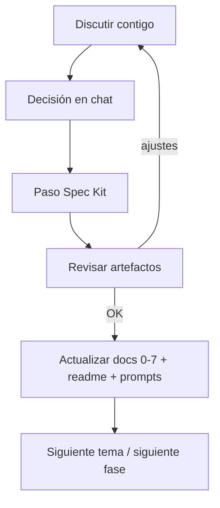

# Flujo de trabajo — Spec Kit + documentación AI4Devs

Registro de la consulta del usuario y la respuesta acordada sobre **cómo empezar con Spec Kit** y el **flujo de trabajo** (discusión → Spec Kit → sync del readme).

**Fecha:** 21 jul 2026  
**Relacionado:** [`docs/SPEC.md`](docs/SPEC.md) · [`prompts.md`](prompts.md) · [`prompts-conversacion-inicial.md`](prompts-conversacion-inicial.md)

---

## Consulta del usuario

Cómo empiezo a utilizar speckit con todas las definiciones que ya acordamos, para que se vaya llenando también el readme mediante avancemos. Además hay cosas que quiero discutir contigo, cómo debería ser el flujo de trabajo

---

## Respuesta (flujo estipulado)

Ya tienes `specify` instalado y el repo con la semilla (`docs/SPEC.md` + docs AI4Devs). El flujo acordado es este:

### Dos capas (no pelearlas)

| Capa | Para qué | Dónde |
|------|----------|--------|
| **Spec Kit** | Decidir e implementar (constitution → spec → plan → tasks → código) | `.specify/`, `specs/` |
| **Entrega máster** | Lo que evalúan | `readme.md`, `0`–`7`, `prompts.md` |

Spec Kit **no rellena solo** el readme. Tras cada fase aprobada, se actualiza el doc AI4Devs correspondiente (de forma explícita al cerrar la fase).

### Flujo de trabajo

**Regla de oro:** nada de implementar “a ciegas”. Si hay duda de producto, UX, alcance o stack → se discute **antes** del comando Spec Kit.

### Fases (orden)

1. **Init** — `specify init --here --force --integration cursor-agent --script ps`  
   (el repo ya no está vacío; `--force` fusiona sin borrar los docs existentes).

2. **Constitution** — `/speckit.constitution`  
   Semilla: principios de `docs/SPEC.md` (seguridad PEM, solo lectura K8s v1, Spec Kit + formato AI4Devs, demo sin URL obligatoria).  
   → Sync: poco en readme; sí anotar en `prompts.md`.

3. **Specify** — `/speckit.specify`  
   Pegar/resumir el MVP acordado (flujo E2E + HU Must/Should).  
   → Sync: `1-descripcion…`, `5-historias…`, ficha `0`.

4. **Clarify** (si hace falta) — `/speckit.clarify`  
   Aquí caben las discusiones pendientes.

5. **Wireframes** — extensión + generate/review  
   → Sync: sección UX en `1-…` + capturas/enlaces.

6. **Plan + draw.io** — `/speckit.plan` + diagramas  
   → Sync: `2-arquitectura…`, `3-modelo…`, `4-comandos-y-eventos-ipc…` (sección “API” de la entrega = IPC).

7. **Tasks** — `/speckit.tasks`  
   → Sync: `6-tickets…`.

8. **Implement** por ticket/PR — `/speckit.implement`  
   → Sync: `7-pull-requests…`, testing, estados en `readme.md`.

### Cómo encajan las discusiones

Tratarlas como **gates** antes de la fase que afectan:

- Nombre, alcance, Must vs Should → antes de **specify**
- Stack, seguridad, URL/demo → antes de **constitution/plan**
- Pantallas, mockups → antes de **wireframes**
- Modelo de datos / commands → antes de **plan**
- Prioridad de tickets → antes de **tasks/implement**

En el chat: *“quiero discutir X”* → acordar → dejarlo por escrito (SPEC o constitution) → recién entonces el slash de Spec Kit.

### Cómo empezar en la práctica

1. Decir qué se quiere discutir primero (lista libre).
2. Cerrar esas decisiones.
3. Correr el **init** de Spec Kit en este repo.
4. Constitution + specify usando `docs/SPEC.md` como input.
5. Tras cada fase OK, actualizar el doc AI4Devs ligado.

### Registro en `prompts.md` (acuerdo)

Cada prompt/skill en [`prompts.md`](prompts.md) debe incluir el **texto completo de la primera consulta** de esa acción (sin resumir). No encadenar follow-ups en el bloque del prompt; esos van solo en la nota de guía si hace falta.
