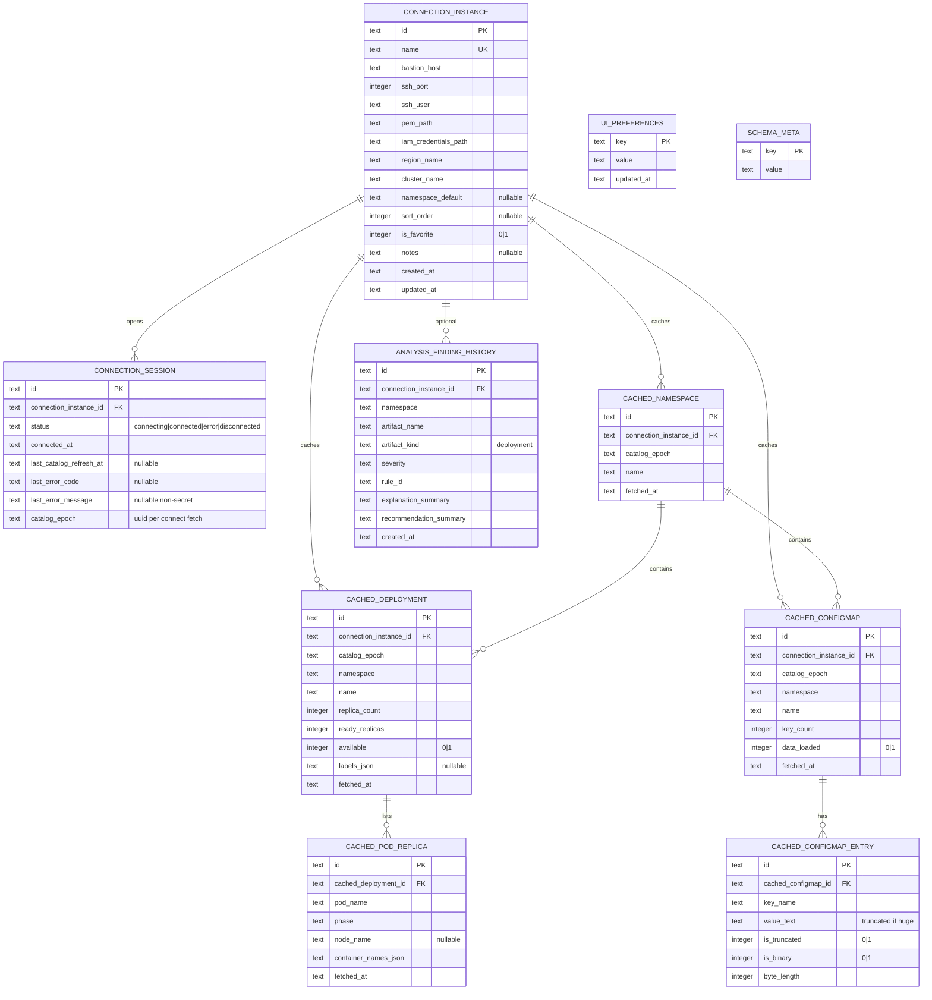
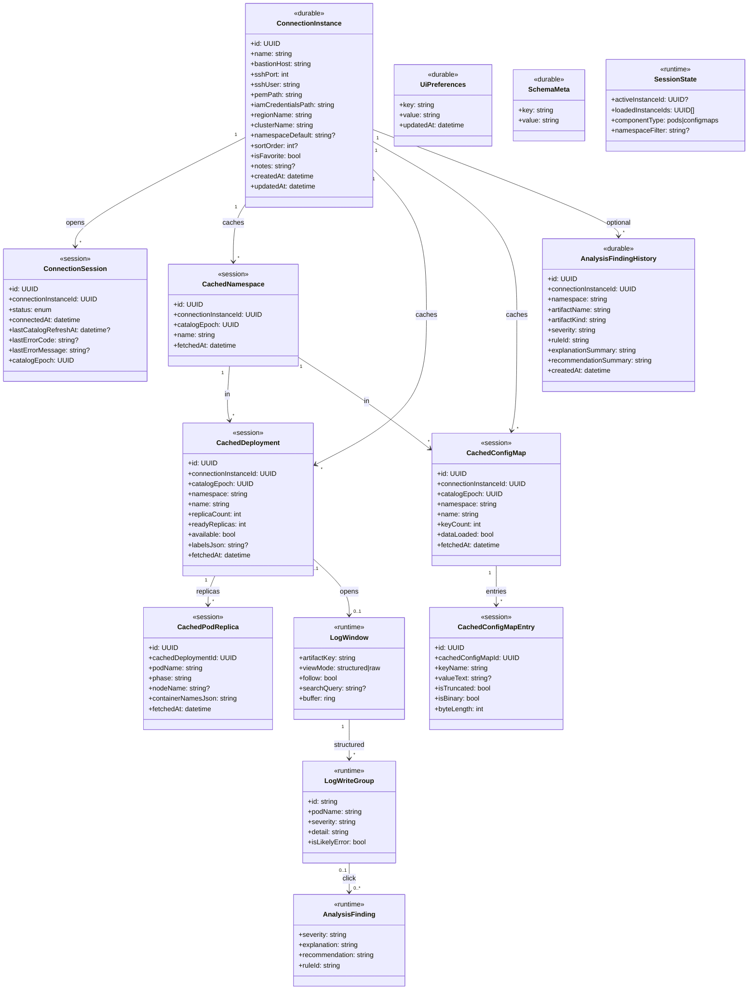

# Data Model: 001-eks-log-monitor

**Date**: 2026-07-23  
**Spec**: [spec.md](./spec.md)  
**Store**: Local SQLite (`tauri-plugin-sql`) — single-user, on-device only (constitution II, IV, VI).

## Persistence tiers

| Tier | Survives app restart? | Purpose |
|------|----------------------|---------|
| **Durable** | Yes | Environment configs, UI prefs, light analysis history metadata |
| **Session cache** | **No** — MUST be wiped on app exit | Catalog artifacts/config fetched once per successful connect (speed) |
| **Runtime only** | N/A (RAM) | Live log buffers, write-groups, open windows, kube/SSH clients |

**Session-cache lifecycle (mandatory):**

```text
app launch → SHOW splash (ventana mínima Faro)
  → session_purge_ephemeral:
       DELETE ALL «session» / log-ephemeral tables
         (connection_session, cached_*, any log staging)
       KEEP ALL «durable»:
         connection_instance, ui_preferences,
         analysis_finding_history, schema_meta
  → dismiss splash → open main window

env_connect OK
  → purge prior cache for that connection_instance_id (if any)
  → fetch Deployments + ConfigMaps (+ namespaces) once from cluster via bastion
  → INSERT into session-cache tables
  → UI lists/filters read from SQLite cache (not re-hit AWS/K8s on every navigation)

optional: catalog_refresh → same fetch+replace for active instance

env_disconnect → DELETE session-cache rows for that instance

app shutdown / process exit (best-effort hook) → DELETE ALL session-cache tables
```

**Crash / dirty exit:** A forced or failed close **can** leave session rows on disk. Splash purge recovers this. Durable environments and prefs are **never** part of that purge. Log stream buffers live in RAM only (already gone on crash); SQLite purge covers leftover session/catalog residue and any future log-staging tables — **not** connection profiles.


Full log dumps MUST NOT be stored in SQLite (constitution IV). ConfigMap **values** may be cached in-session with safe truncation for large/binary keys.

---

## UML — Entity relationship (SQLite)

Stereotypes: `«durable»` = survives restart; `«session»` = wiped on app close; `«runtime»` = not a table.



### Class view (persistence stereotypes)



Editable draw.io companion: [`docs/architecture/04-sqlite-er.drawio`](../../docs/architecture/04-sqlite-er.drawio).  
Splash UX: [`wireframes/01-splash-preparing.svg`](./wireframes/01-splash-preparing.svg).

---

## Durable entities

### ConnectionInstance (Ambiente) — table `connection_instance`

Named environment access profile. **Survives restart** (SC-006).

| Column | Type | Notes |
|--------|------|-------|
| id | TEXT PK | UUID |
| name | TEXT UNIQUE | Display name |
| bastion_host | TEXT NOT NULL | SSH host |
| ssh_port | INTEGER NOT NULL | Default 22 |
| ssh_user | TEXT NOT NULL | |
| pem_path | TEXT NOT NULL | Path only — never PEM bytes |
| iam_credentials_path | TEXT NOT NULL | Path only — never key values |
| region_name | TEXT NOT NULL | e.g. `us-east-1` |
| cluster_name | TEXT NOT NULL | EKS cluster name |
| namespace_default | TEXT NULL | Optional default filter |
| sort_order | INTEGER NULL | Sidebar ordering when loading varios |
| is_favorite | INTEGER NOT NULL DEFAULT 0 | 0/1 |
| notes | TEXT NULL | Free-text operator note (no secrets) |
| created_at | TEXT NOT NULL | ISO-8601 local |
| updated_at | TEXT NOT NULL | ISO-8601 local |

**Validation**: Required `name`, bastion SSH fields, `pem_path`, `iam_credentials_path`, `region_name`, `cluster_name`. Reject empty paths. Never persist PEM/IAM secret contents.

**Connect flow**: SSH tunnel (PEM) + read IAM file → temporary EKS token → kube via localhost → **one-shot catalog hydrate** into session tables.

---

### UiPreferences — table `ui_preferences`

| Column | Type | Notes |
|--------|------|-------|
| key | TEXT PK | e.g. `theme`, `last_active_instance_id`, `sidebar_width_px`, `default_log_view` |
| value | TEXT NOT NULL | Serialized string / JSON scalar |
| updated_at | TEXT NOT NULL | |

**Known keys (v1):**

| key | value | Notes |
|-----|-------|-------|
| `theme` | `light` \| `dark` | Ver menu |
| `last_active_instance_id` | UUID or empty | Restored on launch if instance still exists |
| `sidebar_width_px` | int string | Optional layout chrome |
| `default_component_type` | `pods` \| `configmaps` | Optional remember last catalog tab |
| `default_log_view` | `structured` | MUST remain `structured` for MVP opens (FR-022); key reserved |

---

### AnalysisFindingHistory — table `analysis_finding_history` (optional, light)

| Column | Type | Notes |
|--------|------|-------|
| id | TEXT PK | |
| connection_instance_id | TEXT FK | ON DELETE CASCADE |
| namespace | TEXT | |
| artifact_name | TEXT | Deployment name |
| artifact_kind | TEXT | `deployment` in v1 |
| severity | TEXT | |
| rule_id | TEXT | Local Spring Boot pack |
| explanation_summary | TEXT | Short plain text — **not** full stacktrace body |
| recommendation_summary | TEXT | |
| created_at | TEXT | |

**Persistence rule**: Metadata only; do **not** store full write-group / log bodies.

---

### SchemaMeta — table `schema_meta`

| Column | Type | Notes |
|--------|------|-------|
| key | TEXT PK | e.g. `schema_version` |
| value | TEXT | |

Used for migrations of durable tables.

---

## Session-cache entities (SQLite, ephemeral)

All rows carry `connection_instance_id` and `catalog_epoch` so a reconnect replaces a coherent snapshot. **On application exit, truncate every session table.**

### ConnectionSession — table `connection_session`

At most one **connected** row meaningful for ops; history of the current app run may keep the latest row until purge.

| Column | Type | Notes |
|--------|------|-------|
| id | TEXT PK | |
| connection_instance_id | TEXT FK | |
| status | TEXT | `connecting` \| `connected` \| `error` \| `disconnected` |
| connected_at | TEXT | |
| last_catalog_refresh_at | TEXT NULL | |
| last_error_code | TEXT NULL | Non-secret machine code |
| last_error_message | TEXT NULL | Actionable, no secrets |
| catalog_epoch | TEXT | UUID minted on each successful catalog hydrate |

---

### CachedNamespace — table `cached_namespace`

| Column | Type | Notes |
|--------|------|-------|
| id | TEXT PK | |
| connection_instance_id | TEXT FK | |
| catalog_epoch | TEXT | |
| name | TEXT | |
| fetched_at | TEXT | |
| UNIQUE | (connection_instance_id, catalog_epoch, name) | |

---

### CachedDeployment — table `cached_deployment`

Maps to product **DeploymentArtifact** for catalog UI.

| Column | Type | Notes |
|--------|------|-------|
| id | TEXT PK | |
| connection_instance_id | TEXT FK | |
| catalog_epoch | TEXT | |
| namespace | TEXT | |
| name | TEXT | Workload name |
| replica_count | INTEGER | |
| ready_replicas | INTEGER | |
| available | INTEGER | 0/1 ready-enough for UI badge |
| labels_json | TEXT NULL | Optional subset for filter |
| fetched_at | TEXT | |
| UNIQUE | (connection_instance_id, catalog_epoch, namespace, name) | |

---

### CachedPodReplica — table `cached_pod_replica`

Supports attribution labels and multi-container choice without re-listing every time logs open (still may refresh live status via API when opening follow).

| Column | Type | Notes |
|--------|------|-------|
| id | TEXT PK | |
| cached_deployment_id | TEXT FK | ON DELETE CASCADE |
| pod_name | TEXT | |
| phase | TEXT | |
| node_name | TEXT NULL | |
| container_names_json | TEXT | JSON array of container names |
| fetched_at | TEXT | |

---

### CachedConfigMap — table `cached_configmap`

| Column | Type | Notes |
|--------|------|-------|
| id | TEXT PK | |
| connection_instance_id | TEXT FK | |
| catalog_epoch | TEXT | |
| namespace | TEXT | |
| name | TEXT | |
| key_count | INTEGER | |
| data_loaded | INTEGER | 0 = list-only stub; 1 = entries present |
| fetched_at | TEXT | |
| UNIQUE | (connection_instance_id, catalog_epoch, namespace, name) | |

**Hydrate strategy**: On connect, list ConfigMaps (names + key counts) into cache. On first open of a ConfigMap, fetch data once and fill `cached_configmap_entry` for that row (`data_loaded=1`) within the same session epoch.

---

### CachedConfigMapEntry — table `cached_configmap_entry`

| Column | Type | Notes |
|--------|------|-------|
| id | TEXT PK | |
| cached_configmap_id | TEXT FK | ON DELETE CASCADE |
| key_name | TEXT | |
| value_text | TEXT NULL | Truncated UTF-8 preview when huge |
| is_truncated | INTEGER | 0/1 |
| is_binary | INTEGER | 0/1 — value_text may be placeholder |
| byte_length | INTEGER | Original size hint |
| UNIQUE | (cached_configmap_id, key_name) | |

---

## Runtime-only entities (not SQLite tables)

### SessionState

| Field | Type | Notes |
|-------|------|-------|
| active_instance_id | UUID? | Drives tunnel + kube |
| connection_status | enum | Mirrors / derived from `connection_session` |
| loaded_instance_ids | UUID[] | Sidebar multi-load (may persist only as prefs later; v1 runtime OK) |
| component_type | enum | `pods` \| `configmaps` |
| namespace_filter | string? | |

### LogWindow / LogWriteGroup / AnalysisFinding

Unchanged from prior model: in-memory ring buffer; Structured groups by write; findings from click. Optional write of **summaries** into `analysis_finding_history` after a successful analyze — never the full stacktrace dump.

---

## State transitions

### Connection + catalog cache

```text
disconnected
  → connecting
  → connected + catalog_hydrate (epoch N) → UI reads «session» tables
       ↓ error
     error → disconnected (cache for instance cleared)

catalog_refresh → new epoch N+1 (replace rows for instance)

disconnect / app_exit (best-effort) → purge «session» tables
splash / app_startup → session_purge_ephemeral (KEEP durable connections)
```

Switching **active** instance: invalidate LogWindows → disconnect prior → connect new → new hydrate.

### Log view mode / analysis

```text
open window → structured (default)
structured ↔ raw   (same follow session)

structured + likely_error click → running_rules → finding | empty
  → optional INSERT analysis_finding_history (summary only)
```

No buffer-wide analyze transition in MVP.

---

## Indexes (recommended)

- `connection_instance(name)` UNIQUE already
- `cached_deployment(connection_instance_id, catalog_epoch, namespace, name)`
- `cached_configmap(connection_instance_id, catalog_epoch, namespace, name)`
- `cached_deployment(connection_instance_id, name)` for name filter
- `analysis_finding_history(connection_instance_id, created_at DESC)`

---

## Explicitly NOT persisted

- PEM file contents, IAM access key / secret, tokens, kubeconfig blobs
- Full live log buffers / Raw dumps / complete stacktrace bodies
- Concurrent multi-cluster tunnel state beyond one active session
